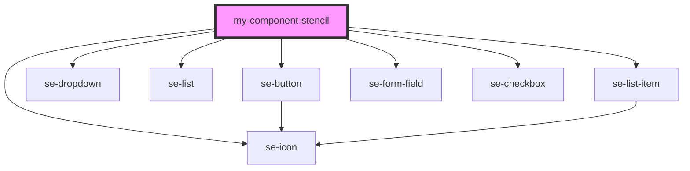

# my-component

<!-- Auto Generated Below -->

## Dependencies

### Depends on

- se-button
- se-dropdown
- se-list
- se-list-item
- se-form-field
- se-checkbox
- se-icon

### Graph

----------------------------------------------

*Built with [StencilJS](https://stenciljs.com/)*
